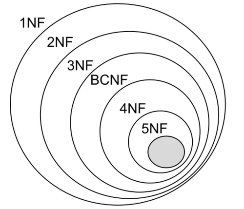

<h1>Database Management System (DBMS):</h1>
<h3><li>Database Normalization in Relational Schema</li></h3>

Database normalization is a technique of organizing the data into multiple related narrower tables with the purpose of minimizing DATA REDUNDANCY. 

<strong> Advantages of data normalization: </strong> 
1) Improving overall database organization 
2) Increasing data consistency 
3) Reducing redundancy 
4) Reducing data management cost 
5) Making it easier to deal with larger amounts of data 

<strong> Types of data normalization: </strong> 
1) 1st normal form (1NF): 
<ul>
1- Each row in the table have a unique identifier (primary key). 
2- Each cell in the table hold an atomic (indivisible) value. 
</ul>
2) 2nd normal form (2NF): 
<ul>
1- The table should be in the 1st normal form. 
2- There should be a <strong>Functional Dependency (FD)</strong> between the PK and every non-key column in the table. There should be <ins>no <strong>Partial Dependencies</strong></ins> in the table. 
<ul>
&rarr;&rarr; What is <strong>Dependency or Functional Dependency (FD)</strong> in a table? 
A functional dependency (FD) is a relationship between two attributes, typically between the primary key (PK) and other non-key attributes within a table. For any relation R, attribute Y is functionally dependent on attribute X (usually the PK), if for every valid instance of X, that value of X uniquely determines the value of Y.

 

        X ———–> Y
        In above example X is the determinant and Y is the dependent.

        SIN ———-> Name, Address, DoB
        A given valid SIN number determines the value of name, address and date of birth.

&rarr;&rarr; What is <strong>Partial Dependency</strong>?
Partial dependency arises when a non-prime attribute is functionally dependent on a portion of a candidate key.

        Employee_ID     Department_ID      Employee_Name        Department_Name
        E01             D01                     John            Marketing
        E02             D02                     Jane            Engineering
        E03             D01                     Tommy           Marketing

Employee_ID (primary key) = A unique ID of the employee 
Employee_Name (non-key attribute) = Name of the employee 
Department_ID (non-key attribute)  = A unique ID of the department 
Department_Name (non-key attribute) = Name of the department 

In the above table, the Department_Name can be determined using the Department_ID, creating a partial dependency. 
Department_ID → Department_Name  
This partial dependency causes redundancy and inconsistency in the table. For example, the Department_Name “marketing” is repeated twice for different employees. If we want to change the name of the department, we have to update multiple rows in the table. This can lead to errors and anomalies.
We can decompose the tables as shown below to remove partial dependencies:

        Employee_ID     Department_ID   Employee_Name
        E01             D01             John
        E02             D02             Jane
        E03             D01             Tommy
 

        Department_ID           Department_Name
        D01                     Marketing
        D02                     Engineering

</ul>
</ul>
3) 3rd normal form (3NF) 
<ul>
1- The table should be in the 2nd normal form. 
2- There should be <ins>no <strong>Transitive Dependencies</strong></ins> in the table. 
<ul>
&rarr;&rarr; What is <strong>Transitive Dependency</strong>?
A transitive dependency exists when you have the following functional dependency pattern.

 

        A ———–> B   and   B ———–> C;    therefore A ———–> C

 

        Book                                    Genre           Author          Author_Nationality
        Anna Karenina                           fiction         Leo TolstoY     Russian
        Leaves of Grass                         Poetry          Walt Whitman	American
        Journey to the Center of the Earth      Sci-Fi          Jules Verne     French

{Book} → {Author}  
{Author} → {Author nationality}  
Therefore {Book} → {Author nationality} is a transitive dependency. 
</ul>
<ul>
4) Boyce-Codd normal form (BCNF) 

