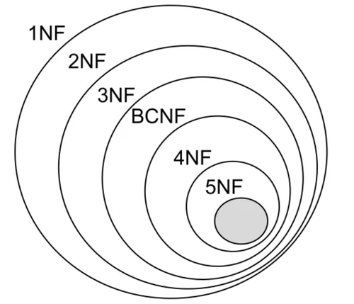

<h1>Database Management System (DBMS):</h1>
<h3><li>Database Normalization in Relational Schema</li></h3>

Database normalization is a technique of organizing the data into multiple related narrower tables with the purpose of minimizing DATA REDUNDANCY. 

<strong> Advantages of data normalization: </strong> 
1) Improving overall database organization 
2) Increasing data consistency 
3) Reducing redundancy 
4) Reducing data management cost 
5) Making it easier to deal with larger amounts of data 

<strong> Types of data normalization: </strong> 
 
 

1- First normal form (1NF): 
1) Each row in the table have a unique identifier (primary key). 
2) Each cell in the table hold an atomic (indivisible) value. 
</ul>
2- Second normal form (2NF): 
<ul>
1) The table should be in the 1st normal form. 
2) There should be a <strong>Functional Dependency (FD)</strong> between the PK and every non-key column in the table. There should be <ins>no <strong>Partial Dependencies</strong></ins> in the table. 
<ul>
&rarr;&rarr; What is <strong>Functional Dependency (FD)</strong>? 
A functional dependency (FD) is a relationship between two attributes, typically between the primary key (PK) and other non-key attributes within a table. For any relation R, attribute Y is functionally dependent on attribute X (usually the PK), if for every valid instance of X, that value of X uniquely determines the value of Y.

 

        X ———–> Y
        In above example X is the determinant and Y is the dependent.

        SIN ———-> Name, Address, DoB
        A given valid SIN number determines the value of name, address and date of birth.

&rarr;&rarr; What is <strong>Partial Dependency</strong>?  
A partial dependency exists when a non-primary column depends upon a single column that is a part of <strong>a composite primary key</strong>. Note <ins>partial dependency cannot occur when there is a simple primary key.</ins>

        student_id      subject_id      marks   teacher_name
        10              1               70      Java Teacher
        10              2               75      C++ Teacher
        11              1               80      Java Teacher

In the above table, student_id and subject_id forms a composite primary key. If you need to get the mark for the students_id 10 you need to enter the subject_id too. Therefore, we need student_id + subject_id to uniquely identify any row. However, teacher_name depends only on subject_id, this causes partial dependency.

{student_id + subject_id} (composite primary key) → {marks}  
{subject_id} → {teacher_name}  
<ins>Therefore {subject_id} → {teacher_name} is a partial dependency.</ins> 
</ul>
</ul>
3- Third normal form (3NF) 
<ul>
1- The table should be in the 2nd normal form. 
2- There should be <ins>no <strong>Transitive Dependencies</strong></ins> in the table. 
<ul>
&rarr;&rarr; What is <strong>Transitive Dependency</strong>?
A transitive dependency exists when you have the following functional dependency pattern.

 

        A ———–> B   and   B ———–> C;    therefore A ———–> C

 

        Book                                    Genre           Author          Author_Nationality
        Anna Karenina                           fiction         Leo TolstoY     Russian
        Leaves of Grass                         Poetry          Walt Whitman	American
        Journey to the Center of the Earth      Sci-Fi          Jules Verne     French

{Book} → {Author}  
{Author} → {Author nationality}  
<ins>Therefore {Book} → {Author nationality} is a transitive dependency.</ins> 
</ul>
</ul>
4- Boyce-Codd normal form (BCNF) 

